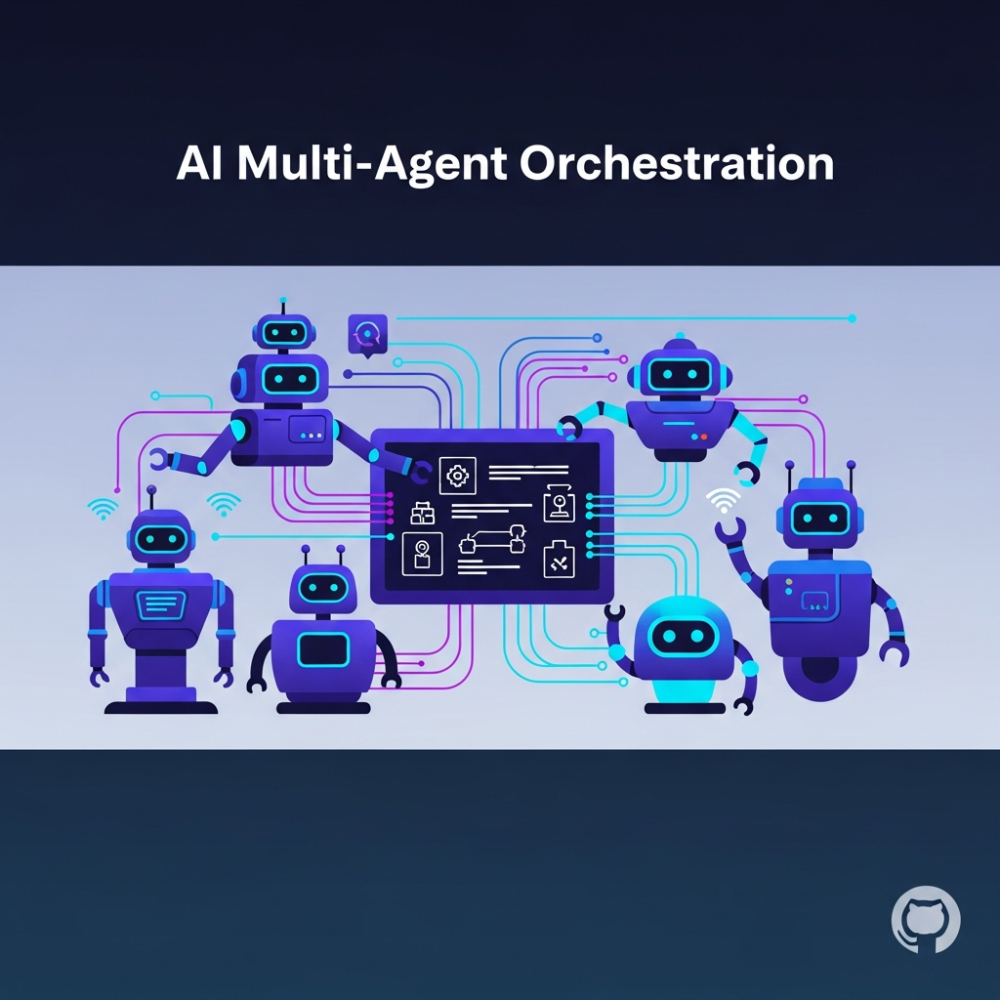
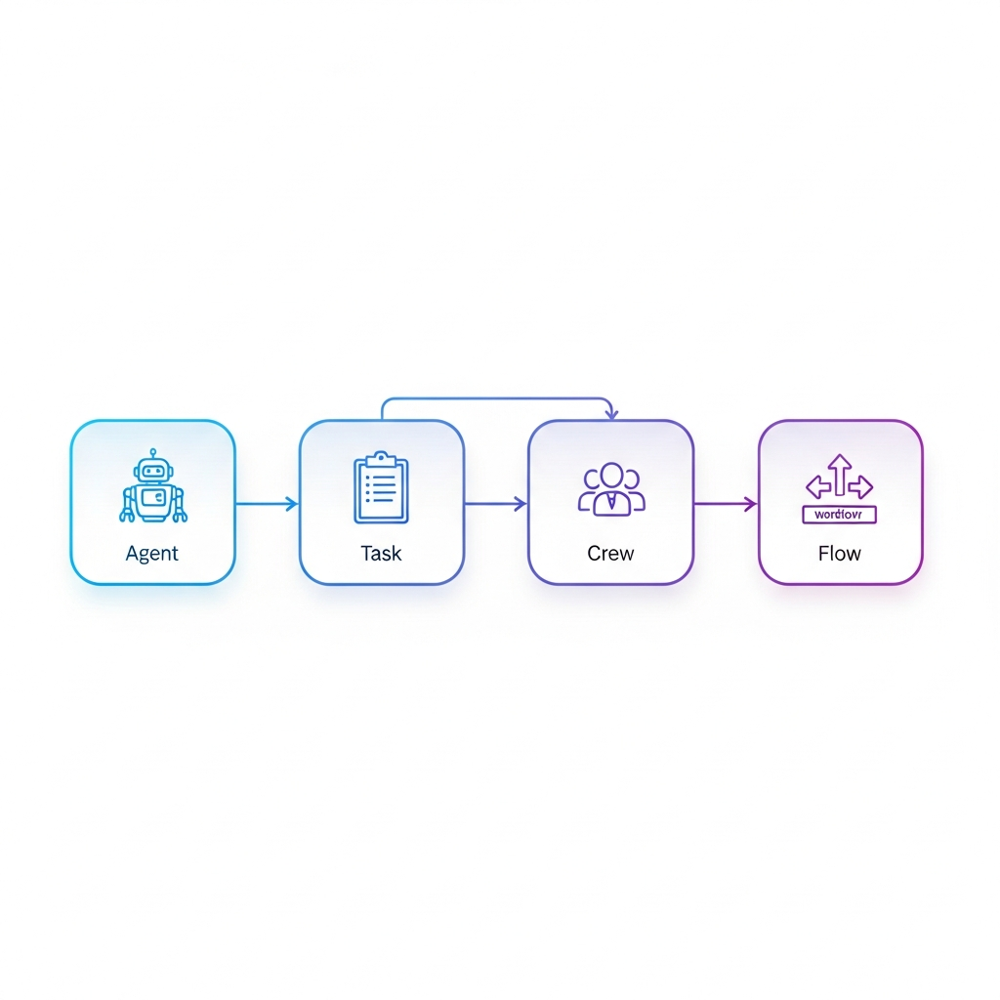
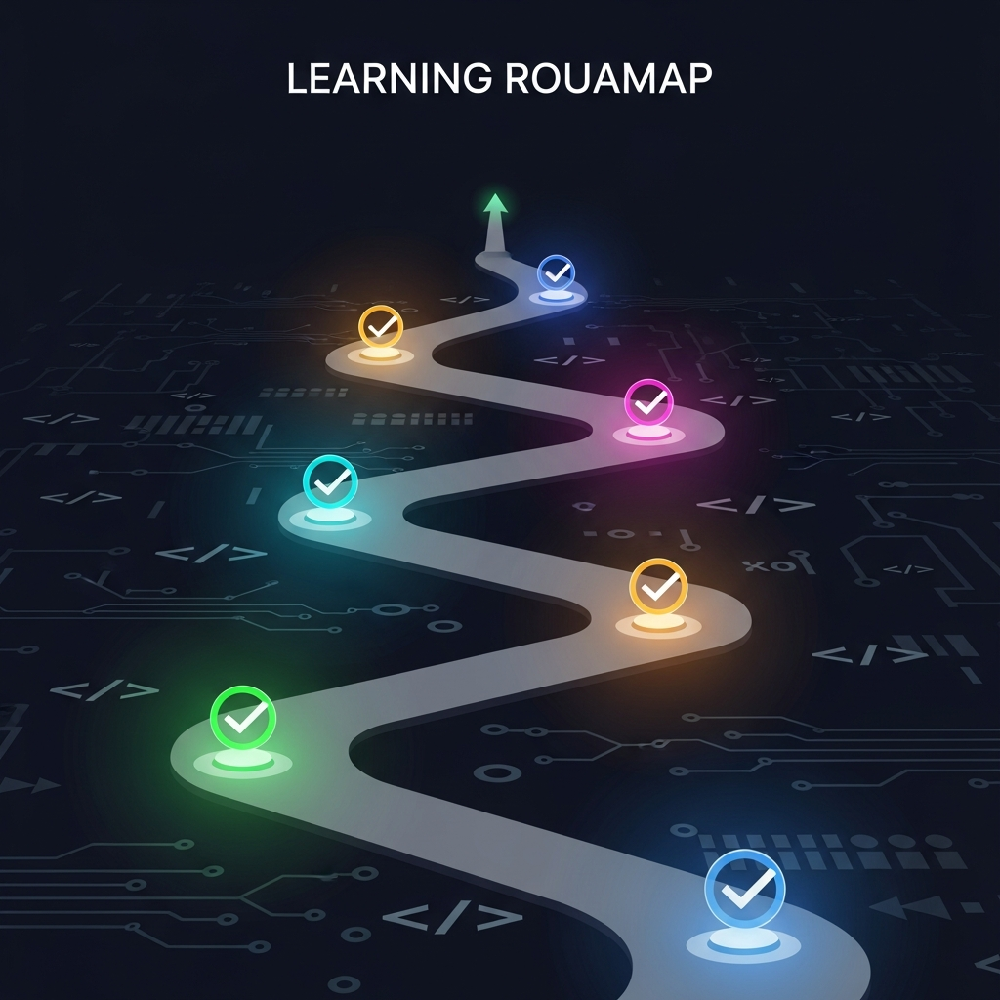

<p align="center">
  
</p>

<h1 align="center">ai-agent-crewai</h1>

<p align="center">
  使用 <a href="https://crewai.com/">CrewAI</a> 框架学习和实践多智能体编排（Multi-Agent Orchestration）
</p>

<p align="center">
  
  
  
</p>

---

## 环境要求

- **Python** >=3.10, <3.14
- **[uv](https://github.com/astral-sh/uv)** — CrewAI 推荐的包管理器（比 pip 快 10-100x）

## 快速安装

```bash
# 1. 安装 uv（macOS/Linux）
curl -LsSf https://astral.sh/uv/install.sh | sh

# 2. 安装 CrewAI CLI
uv tool install crewai

# 验证安装
uv tool list
```

## 创建第一个 Crew 项目

```bash
# 脚手架生成项目
crewai create crew my_first_crew
cd my_first_crew

# 安装依赖
crewai install

# 运行
crewai run
```

<details>
<summary>📂 生成的项目结构</summary>

```
my_first_crew/
├── src/my_first_crew/
│   ├── config/
│   │   ├── agents.yaml      # 智能体定义（角色、目标、背景）
│   │   └── tasks.yaml        # 任务定义（描述、期望输出）
│   ├── crew.py               # Crew 编排逻辑
│   ├── main.py               # 入口文件
│   └── tools/                # 自定义工具
├── pyproject.toml
└── .env                      # API Keys
```

</details>

---

## 核心概念速览

<p align="center">
  
</p>

### 1. Agent（智能体）

自主实体，具有角色、目标和背景故事。

```yaml
# agents.yaml
researcher:
  role: "{topic} Senior Data Researcher"
  goal: "Uncover cutting-edge developments in {topic}"
  backstory: "You're a seasoned researcher with a knack for uncovering the latest developments..."
```

> 关键参数：`role` `goal` `backstory` `llm` `tools` `memory` `verbose` `allow_delegation` `max_iter` `reasoning`

### 2. Task（任务）

分配给智能体的具体工作单元。

```yaml
# tasks.yaml
research_task:
  description: "Conduct thorough research about {topic}..."
  expected_output: "A list with 10 bullet points of relevant information"
  agent: researcher
  output_file: report.md
```

### 3. Crew（团队）

将智能体和任务组合在一起协作。

```python
from crewai import Agent, Crew, Process, Task
from crewai.project import CrewBase, agent, crew, task

@CrewBase
class MyCrew():
    @agent
    def researcher(self) -> Agent:
        return Agent(config=self.agents_config['researcher'], tools=[SerperDevTool()])

    @task
    def research_task(self) -> Task:
        return Task(config=self.tasks_config['research_task'])

    @crew
    def crew(self) -> Crew:
        return Crew(agents=self.agents, tasks=self.tasks, process=Process.sequential, verbose=True)
```

### 4. Flow（工作流）

事件驱动的编排层，用于连接多个 Crew、管理状态和控制执行流程。

```python
from crewai.flow.flow import Flow, listen, start

class MyFlow(Flow):
    @start()
    def initialize(self):
        return "start data"

    @listen(initialize)
    def process(self, data):
        # 可以在这里调用 Crew
        result = MyCrew().crew().kickoff(inputs={"topic": data})
        return result.raw
```

> 核心装饰器：`@start()` 入口方法 · `@listen(method)` 监听触发 · `@router(method)` 条件路由 · `and_()` / `or_()` 组合条件

### 5. Tools（工具）

智能体可以使用的外部能力（搜索、API 调用、文件操作等）。

```bash
uv add crewai-tools
```

---

## 学习路线

<p align="center">
  
</p>

| 阶段 | 内容 | 资源 |
|:---:|------|------|
| **1. 入门** | 安装 + 跑通第一个 Crew | [Quickstart](https://docs.crewai.com/en/quickstart) |
| **2. 基础** | 理解 Agent / Task / Crew 参数 | [Agents](https://docs.crewai.com/en/concepts/agents) · [Tasks](https://docs.crewai.com/en/concepts/tasks) · [Crews](https://docs.crewai.com/en/concepts/crews) |
| **3. 工具** | 学习内置工具 + 自定义工具 | [Tools](https://docs.crewai.com/en/concepts/tools) |
| **4. 进阶** | Flow 编排多 Crew 工作流 | [Flows](https://docs.crewai.com/en/concepts/flows) |
| **5. 实战** | 跑通官方示例项目 | [crewAI-examples](https://github.com/crewAIInc/crewAI-examples) |
| **6. 深入** | Memory / Knowledge / RAG | [Memory](https://docs.crewai.com/en/concepts/memory) · [Knowledge](https://docs.crewai.com/en/concepts/knowledge) |

---

## 常用 CLI 命令

| 命令 | 说明 |
|------|------|
| `crewai create crew <name>` | 创建新 Crew 项目 |
| `crewai create flow <name>` | 创建新 Flow 项目 |
| `crewai install` | 安装项目依赖 |
| `crewai run` | 运行项目 |
| `crewai test` | 测试 Crew |
| `crewai log-tasks-outputs` | 查看任务输出日志 |

---

## 学习资源

**官方资源**

| 资源 | 链接 |
|------|------|
| 官方文档 | [docs.crewai.com](https://docs.crewai.com/en/introduction) |
| GitHub 仓库 | [crewAIInc/crewAI](https://github.com/crewAIInc/crewAI) |
| 完整示例项目 | [crewAI-examples](https://github.com/crewAIInc/crewAI-examples) |
| 快速上手 Demo | [crewAI-quickstarts](https://github.com/crewAIInc/crewAI-quickstarts) |
| 官方博客 | [blog.crewai.com](https://blog.crewai.com/) |
| 社区论坛 | [community.crewai.com](https://community.crewai.com/) |

**教程与文章**

- [Build your First CrewAI Agents（官方博客）](https://blog.crewai.com/getting-started-with-crewai-build-your-first-crew/)
- [CrewAI: A Guide With Examples — DataCamp](https://www.datacamp.com/tutorial/crew-ai)
- [What is crewAI? — IBM](https://www.ibm.com/think/topics/crew-ai)
- [CrewAI — AWS Prescriptive Guidance](https://docs.aws.amazon.com/prescriptive-guidance/latest/agentic-ai-frameworks/crewai.html)

**Quickstart 专题**

| 示例 | 内容 |
|------|------|
| Collaboration | 多智能体协作模式 |
| Custom LLM | 接入自定义 LLM（Anthropic、本地模型等）|
| Guardrails | 安全护栏与输出验证 |
| Planning | 任务规划与编排 |
| Reasoning | 高级推理模式 |
